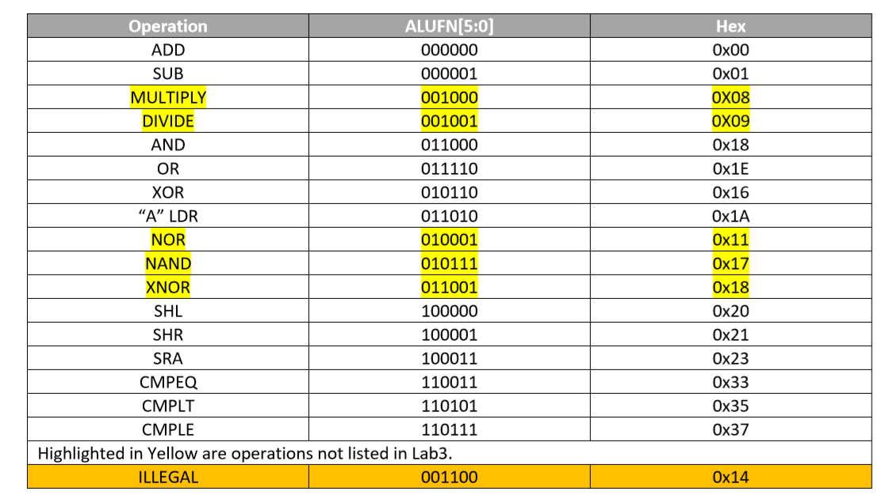
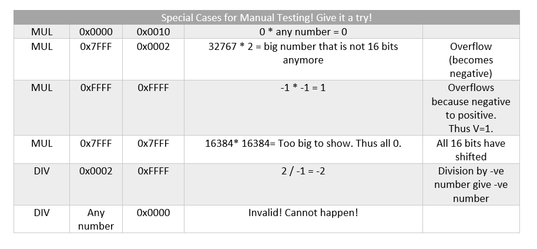
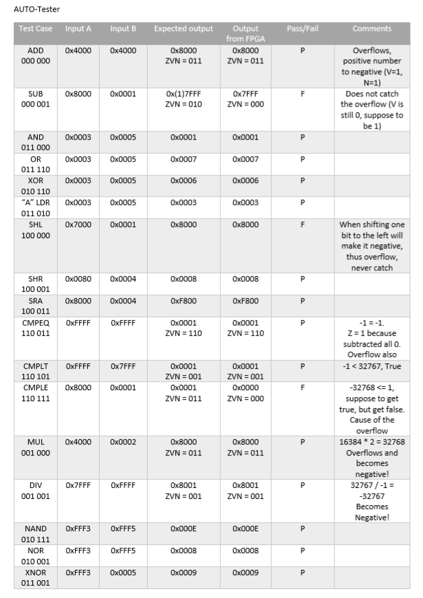

# 1D - Computational Structures CheckOff for ALU on Alchitry
## ALUFN Codes
Our Implementation follows the Lab 3 handout and then we added several extra operations as seen in the table below!

All other ALUFN code is illegal. The entry at the top for the ILLEGAL is just an example of illegal ALUFN code that you can test.
## Schematics of ALU
(Insert ALU photo)  
## Finite State Machine (FSM)
Below shows the FSM of test cases.
We have a Manual mode that takes in user Input A and B (16-bits) and then the ALUFN Code (6-bits). This is stored in registers (dff) and then used in the calculations when all the relevant inputs are given. Then it will output at different part of the Alchitry IO like the 7-segment display and the IO_LEDs.   
Also, we have 2 auto mode:
1. Takes in 2 inputs from the user and run through all the ALU operations that is in the library.
2. Run special cases that we programed inside. The cases can be found in the 'Auto Test Cases' section.  
(Insert FSM photo)
## Manual Test Cases
Below are some of the manual cases for Multiply and Divide that can prove its functionality and some of the limitations of the 16-bit ALU.
 
## Auto Test Cases
Below is the table of test cases that we programmed into the Alchitry to run auto test cases. The first 7-segment display on the far left will display "P" for pass and "F" for fail. We have documented the expected output and output of the Alchitry here too for ease of viewing.
